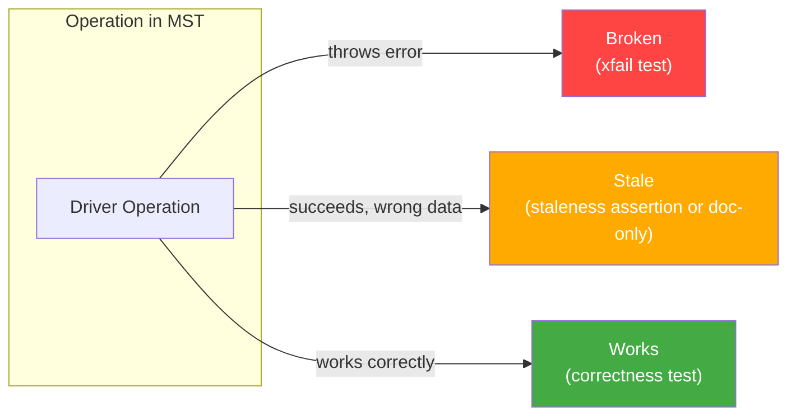
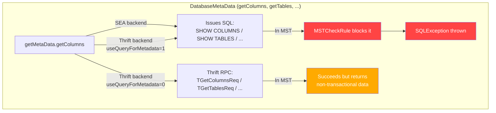
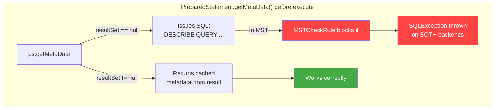
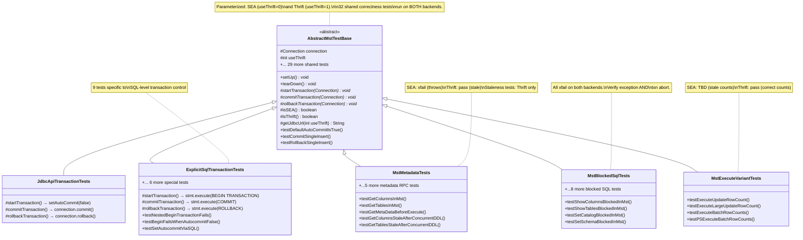
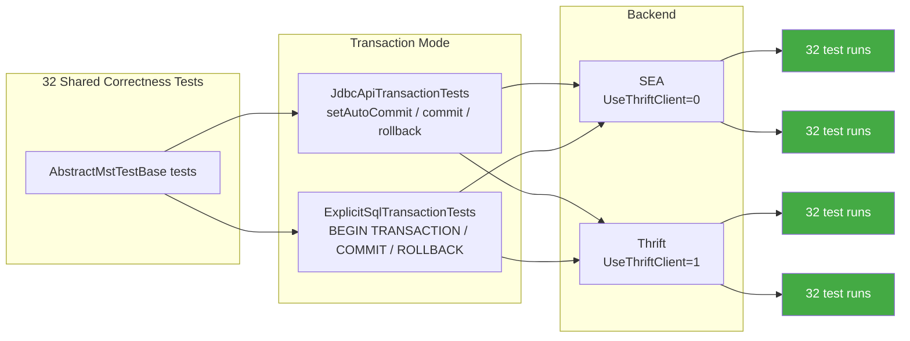
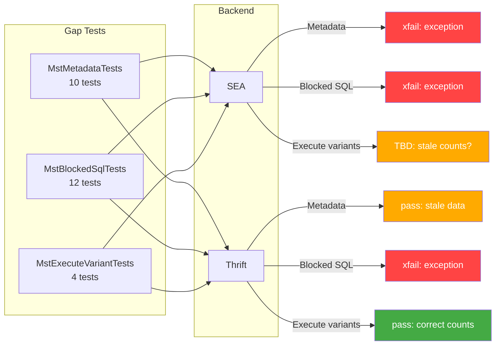
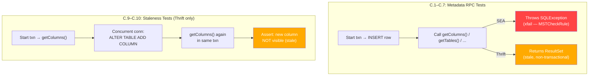
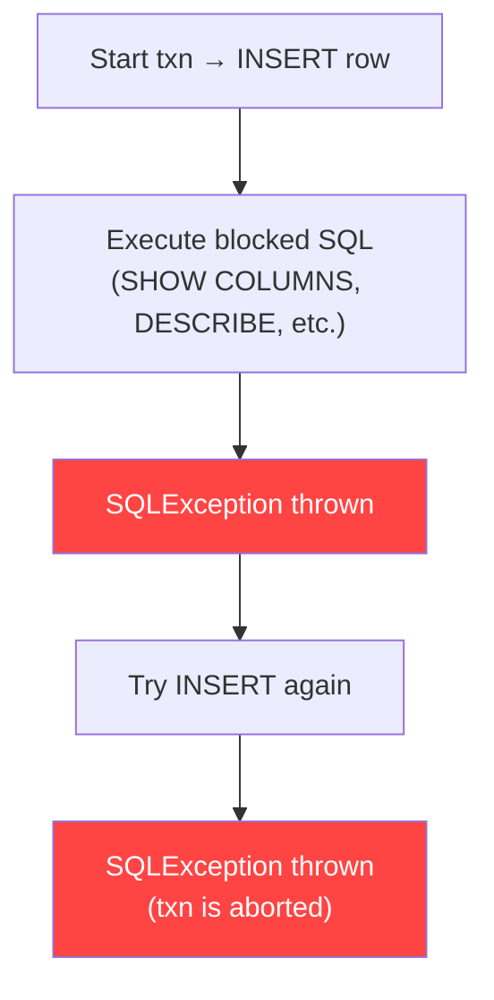
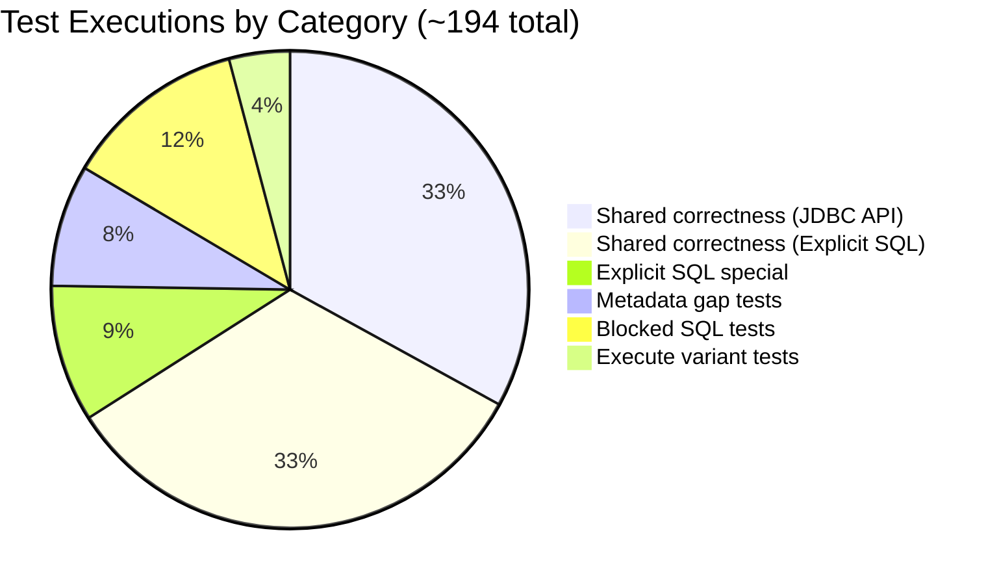
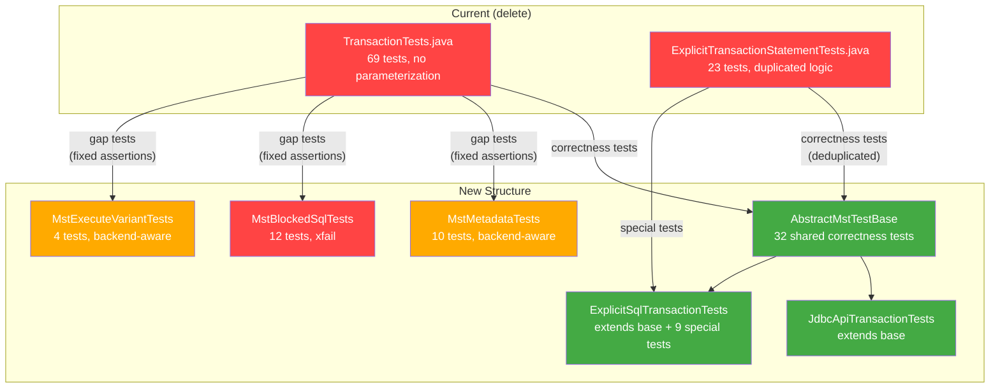

# MST Transaction Test Design

## Context

Multi-Statement Transactions (MST) interact with many JDBC driver code paths differently depending on the backend (SEA vs Thrift). Several server-side bugs (LC-13424, LC-13425, LC-13427, LC-13428) cause operations to either **break** (throw errors) or return **stale data** inside transactions. This test suite provides comprehensive coverage so the server team can validate fixes as they land.

Reference: [MST + xDBC Metadata RPCs audit](https://docs.google.com/document/d/1WSX5imeH8lwiWB6hrKJbL-D6iROxZ7EPWhdxzu-ObTo/edit)

## Operation Categorization

Every driver operation that touches MST falls into one of three buckets:



### How operations route through the driver

The same JDBC method can take completely different code paths depending on the backend:





### Broken (throws error — test as xfail)

| Operation | SEA | Thrift | Bug |
|---|---|---|---|
| `getColumns()` | Broken — issues `SHOW COLUMNS`, blocked by MSTCheckRule | Works (but stale, see below) | LC-13425 |
| `getTables()` | Broken — issues `SHOW TABLES`, blocked | Works (stale) | LC-13425 |
| `getSchemas()` | Broken — issues `SHOW SCHEMAS`, blocked | Works (stale) | LC-13425 |
| `getCatalogs()` | Broken — issues `SHOW CATALOGS`, blocked | Works (stale) | LC-13425 |
| `getPrimaryKeys()` | Broken | Works (stale) | LC-13425 |
| `getCrossReference()` | Broken | Works (stale) | LC-13425 |
| `getFunctions()` | Broken — issues `SHOW FUNCTIONS`, blocked | Works (stale) | LC-13425 |
| `PreparedStatement.getMetaData()` before execute | Broken — issues `DESCRIBE QUERY` SQL | Broken — same path, issues SQL | LC-13425 |
| `setCatalog()` | Broken — `SET CATALOG` blocked in MST | Broken — same | |
| `setSchema()` | Broken — `USE SCHEMA` blocked in MST | Broken — same | |
| All SHOW/DESCRIBE/information_schema SQL | Broken — MSTCheckRule | Broken — MSTCheckRule | LC-13425 |

### Stale (succeeds but returns non-transactional data)

| Operation | Backend | Behavior | Testable? |
|---|---|---|---|
| `getColumns()`, `getTables()`, `getSchemas()`, `getCatalogs()`, `getPrimaryKeys()`, `getCrossReference()`, `getFunctions()` via Thrift RPC | Thrift (default) | Thrift RPCs bypass MST context entirely. Succeed but return data that doesn't reflect uncommitted transaction state. | Yes — assert staleness via concurrent DDL |
| `executeUpdate()` / `executeBatch()` row counts | SEA | Returns incorrect/stale row counts. The DML itself works but the returned count is wrong. | TBD — need E2E to confirm exact return value |

### Works (test for correctness)

Basic DML (`execute`, `executeQuery`), commit/rollback, isolation, error handling, connection lifecycle, `PreparedStatement.getMetaData()` after execute, `getParameterMetaData()`.

## Test Architecture

### Class Hierarchy



### How tests execute across backends and transaction modes



The gap tests (MstMetadataTests, MstBlockedSqlTests, MstExecuteVariantTests) only use the JDBC API transaction mode — MSTCheckRule doesn't care how the transaction was started:



### Backend parameterization

Every test class is parameterized with `(useThrift, backendName)`:

```java
static Stream<Arguments> backends() {
    return Stream.of(
        Arguments.of(0, "SEA"),
        Arguments.of(1, "Thrift")
    );
}
```

Individual tests use `Assumptions` to skip when only relevant to one backend:

```java
// Example: staleness test only runs on Thrift
Assumptions.assumeTrue(isThrift(), "Staleness only testable on Thrift");

// Example: different assertion per backend
if (isSEA()) {
    assertThrows(SQLException.class, () -> dbmd.getColumns(...));
} else {
    ResultSet rs = dbmd.getColumns(...);
    assertTrue(rs.next()); // returns stale data, but doesn't throw
}
```

## Test Plan

### A. Shared correctness tests (in AbstractMstTestBase)

Run by both JdbcApiTransactionTests and ExplicitSqlTransactionTests, on both SEA and Thrift.

| # | Test | Description | Expected |
|---|---|---|---|
| A.1 | `testDefaultAutoCommitIsTrue` | New connection defaults to autoCommit=true | Pass |
| A.2 | `testCommitSingleInsert` | Disable autocommit → INSERT → commit → verify from separate conn | Pass |
| A.3 | `testCommitMultipleInserts` | Disable autocommit → 3 INSERTs → commit → verify all 3 rows | Pass |
| A.4 | `testRollbackSingleInsert` | Disable autocommit → INSERT → rollback → verify not persisted | Pass |
| A.5 | `testMultipleSequentialTransactions` | 3 sequential txns (commit, commit, rollback) → verify only first two persist | Pass |
| A.6 | `testAutoStartAfterCommit` | Commit txn1 → insert+rollback txn2 → only txn1 data persists | Pass |
| A.7 | `testAutoStartAfterRollback` | Rollback txn1 → insert+commit txn2 → only txn2 data persists | Pass |
| A.8 | `testUpdateInTransaction` | Insert with autocommit → UPDATE in txn → commit → verify updated | Pass |
| A.9 | `testDeleteInTransaction` | Insert 2 rows → DELETE one in txn → commit → verify 1 remains | Pass |
| A.10 | `testMultiTableCommit` | Insert into 2 tables in txn → commit → verify both from separate conn | Pass |
| A.11 | `testMultiTableRollback` | Insert into 2 tables in txn → rollback → verify neither persisted | Pass |
| A.12 | `testMultiTableAtomicity` | Insert into A → invalid SQL on B → rollback → verify A also rolled back | Pass |
| A.13 | `testCrossTableMerge` | MERGE across source/target tables in txn → commit → verify | Pass |
| A.14 | `testRepeatableReads` | Read in txn → external conn modifies → re-read in txn → same value | Pass |
| A.15 | `testWriteConflictSingleTable` | Two concurrent txns on same table → first commits → second gets ConcurrentAppendException | Pass |
| A.16 | `testWriteSkewProvesSnapshotIsolation` | Two concurrent txns on different tables → both commit → proves Snapshot Isolation | Pass |
| A.17 | `testCommitWithoutActiveTxnThrows` | autocommit=true → commit() → expect exception | Pass |
| A.18 | `testRollbackWithoutActiveTxnBehavior` | autocommit=true → rollback() → document behavior (JDBC throws, explicit SQL is no-op) | Pass |
| A.19 | `testSetAutoCommitDuringActiveTxnThrows` | In active txn → setAutoCommit(true) → expect exception | Pass |
| A.20 | `testUnsupportedIsolationLevel` | Set isolation to READ_UNCOMMITTED/READ_COMMITTED/SERIALIZABLE → expect exception | Pass |
| A.21 | `testSupportedIsolationLevel` | Set isolation to REPEATABLE_READ → verify | Pass |
| A.22 | `testCloseConnectionImplicitRollback` | Insert in txn → close() without commit → verify not persisted from new conn | Pass |
| A.23 | `testCloseConnectionDoesNotThrow` | Insert in txn → close() → no exception | Pass |
| A.24 | `testEmptyTransactionRollback` | Disable autocommit → rollback() immediately → no exception | Pass |
| A.25 | `testReadOnlyTransaction` | SELECT-only in txn → commit → data unchanged | Pass |
| A.26 | `testRollbackAfterQueryFailure` | Insert → invalid SQL → rollback → new txn → insert → commit → verify recovery | Pass |
| A.27 | `testMultipleStatementsInSingleTxn` | 3 Statement objects each insert → commit → verify 3 rows | Pass |
| A.28 | `testPreparedStatementInsert` | Parameterized INSERT in txn → commit → verify | Pass |
| A.29 | `testPreparedStatementUpdate` | Insert → parameterized UPDATE in txn → commit → verify | Pass |
| A.30 | `testPreparedStatementReuseAcrossTransactions` | Same PreparedStatement used in txn1 (commit) and txn2 (commit) → verify both rows | Pass |
| A.31 | `testPreparedStatementGetMetaDataAfterExecute` | Execute PreparedStatement SELECT → getMetaData() → verify column count | Pass |
| A.32 | `testGetParameterMetaData` | Create parameterized PreparedStatement → getParameterMetaData() → verify non-null | Pass |

### B. ExplicitSqlTransactionTests — special tests

Only for the explicit SQL transaction mode. Run on both backends.

| # | Test | Description | Expected |
|---|---|---|---|
| B.1 | `testBeginTransactionFailsWhenAutocommitFalse` | SET AUTOCOMMIT = FALSE → BEGIN TRANSACTION → expect exception | Pass |
| B.2 | `testNestedBeginTransactionFails` | BEGIN TRANSACTION → BEGIN TRANSACTION → expect exception | Pass |
| B.3 | `testSetAutocommitFalseCommit` | SET AUTOCOMMIT = FALSE → INSERT → COMMIT → verify persisted | Pass |
| B.4 | `testSetAutocommitFalseRollback` | SET AUTOCOMMIT = FALSE → INSERT → ROLLBACK → verify not persisted | Pass |
| B.5 | `testSetAutocommitTrue` | SET AUTOCOMMIT = FALSE → commit → SET AUTOCOMMIT = TRUE → INSERT auto-commits | Pass |
| B.6 | `testSetAutocommitWithoutValue` | SET AUTOCOMMIT → returns current value → change → query again → different value | Pass |
| B.7 | `testSetAutocommitTrueDuringActiveTxnFails` | SET AUTOCOMMIT = FALSE → INSERT → SET AUTOCOMMIT = TRUE → expect exception | Pass |
| B.8 | `testExplicitCommitWithoutActiveTxn` | COMMIT SQL without active txn → expect exception | Pass |
| B.9 | `testExplicitRollbackWithoutActiveTxn` | ROLLBACK SQL without active txn → safe no-op, connection usable | Pass |

### C. MstMetadataTests — metadata RPCs in MST

Uses JDBC API mode (`setAutoCommit(false)`) for transaction control. Run on both backends with backend-aware assertions.



| # | Test | SEA | Thrift |
|---|---|---|---|
| C.1 | `testGetColumnsInMst` | xfail: expect exception | Pass: returns results (stale) |
| C.2 | `testGetTablesInMst` | xfail: expect exception | Pass: returns results (stale) |
| C.3 | `testGetSchemasInMst` | xfail: expect exception | Pass: returns results (stale) |
| C.4 | `testGetCatalogsInMst` | xfail: expect exception | Pass: returns results (stale) |
| C.5 | `testGetPrimaryKeysInMst` | xfail: expect exception | Pass: returns results (stale) |
| C.6 | `testGetCrossReferenceInMst` | xfail: expect exception | Pass: returns ResultSet |
| C.7 | `testGetFunctionsInMst` | xfail: expect exception | Pass: returns results (stale) |
| C.8 | `testPreparedStatementGetMetaDataBeforeExecute` | xfail: expect exception (DESCRIBE QUERY blocked) | xfail: same |
| C.9 | `testGetColumnsStaleAfterConcurrentAddColumn` | Skip (would throw before staleness check) | Assert: second getColumns() does NOT see new column added by concurrent conn |
| C.10 | `testGetTablesStaleAfterConcurrentCreateTable` | Skip | Assert: second getTables() does NOT see new table created by concurrent conn |

### D. MstBlockedSqlTests — SQL introspection blocked by MSTCheckRule

Uses JDBC API mode. Run on both backends. All xfail.



| # | Test | SQL Statement |
|---|---|---|
| D.1 | `testShowColumnsBlockedInMst` | `SHOW COLUMNS IN <table>` |
| D.2 | `testShowTablesBlockedInMst` | `SHOW TABLES IN <schema>` |
| D.3 | `testShowSchemasBlockedInMst` | `SHOW SCHEMAS IN <catalog>` |
| D.4 | `testShowCatalogsBlockedInMst` | `SHOW CATALOGS` |
| D.5 | `testShowFunctionsBlockedInMst` | `SHOW FUNCTIONS` |
| D.6 | `testDescribeQueryBlockedInMst` | `DESCRIBE QUERY SELECT * FROM <table>` |
| D.7 | `testDescribeTableExtendedBlockedInMst` | `DESCRIBE TABLE EXTENDED <table>` |
| D.8 | `testDescribeTableBlockedInMst` | `DESCRIBE TABLE <table>` |
| D.9 | `testDescribeColumnBlockedInMst` | `DESCRIBE <table>.<column>` |
| D.10 | `testInformationSchemaBlockedInMst` | `SELECT FROM information_schema.columns` |
| D.11 | `testSetCatalogBlockedInMst` | `connection.setCatalog()` |
| D.12 | `testSetSchemaBlockedInMst` | `connection.setSchema()` |

### E. MstExecuteVariantTests — execute method row counts

Uses JDBC API mode. Backend-aware assertions.

| # | Test | SEA | Thrift |
|---|---|---|---|
| E.1 | `testExecuteUpdateRowCount` | TBD after E2E — assert stale count if confirmed | Pass: assert correct count |
| E.2 | `testExecuteLargeUpdateRowCount` | TBD after E2E | Pass: assert correct count |
| E.3 | `testExecuteBatchRowCounts` | TBD after E2E | Pass: assert correct counts |
| E.4 | `testPreparedStatementExecuteBatchRowCounts` | TBD after E2E | Pass: assert correct counts |

## Test Counts



| Class | Unique tests | Executions (×2 backends) |
|---|---|---|
| AbstractMstTestBase (via JdbcApiTransactionTests) | 32 | 64 |
| AbstractMstTestBase (via ExplicitSqlTransactionTests) | 32 | 64 |
| ExplicitSqlTransactionTests (special) | 9 | 18 |
| MstMetadataTests | 10 | 16 (some skip on one backend) |
| MstBlockedSqlTests | 12 | 24 |
| MstExecuteVariantTests | 4 | 8 |
| **Total** | **67 unique** | **~194 executions** |

## Migration from current tests

### Current state

- `TransactionTests.java` — 69 tests, not parameterized, hardcoded credentials, mixes correctness tests with gap tests, many weak/incorrect assertions
- `ExplicitTransactionStatementTests.java` — 23 tests, duplicates many correctness tests from TransactionTests

### What changes



1. **Delete** both existing files
2. **Create** the new class hierarchy above
3. **Move** correctness tests into `AbstractMstTestBase` (deduplicated — currently duplicated across TransactionTests and ExplicitTransactionStatementTests)
4. **Fix** gap tests: replace speculative assertions with backend-aware xfail/staleness assertions
5. **Delete** tests with zero assertions (DDL documentation tests, statement timeout, empty commit)
6. **Add** staleness tests (C.9, C.10) — new, didn't exist before
7. **Parameterize** everything on SEA/Thrift

### Tests being removed (and why)

| Test | Reason |
|---|---|
| `testDDLCreateTableInTransaction` | Zero assertions, purely prints |
| `testDDLDropTableInTransaction` | Zero assertions |
| `testDDLAlterTableInTransaction` | Zero assertions |
| `testParameterizedDMLAfterConcurrentAlterTable` | Zero assertions, same underlying issue as metadata staleness |
| `testTransactionAfterStatementTimeout` | No assertions on recovery |
| `testEmptyTransactionCommit` | Allows both success and failure — untestable without E2E |
| `testRetryAfterConcurrentAppendException` | Non-deterministic assertion (`>= 2` rows) |
| `testExceptionDetailsPreserved` | Tests driver exception internals, not MST behavior |
| `testResultSetHoldabilityOverCommit` | Not MST-specific |
| `testTransactionContinuesAfterAllowedMetadataOp` | Redundant with multi-insert correctness tests |

### Tests being kept (moved into new structure)

All basic correctness tests (commit, rollback, isolation, multi-table, error handling, PreparedStatement) move into `AbstractMstTestBase`. Gap tests (metadata, blocked SQL, execute variants) move into their respective specialized classes with proper backend-aware assertions.

## Open items

- [ ] Run E2E on SEA to confirm `executeUpdate()` row count behavior (stale value vs exception)
- [ ] Run E2E to confirm `getMetaData()` before execute throws on both backends
- [ ] Decide if `isValid()` inside MST needs a test (currently issues `SELECT VERSION()`, likely works)
- [ ] Python driver test refactoring (separate effort, similar structure but no Thrift/SEA split needed today since Python defaults to Thrift)
