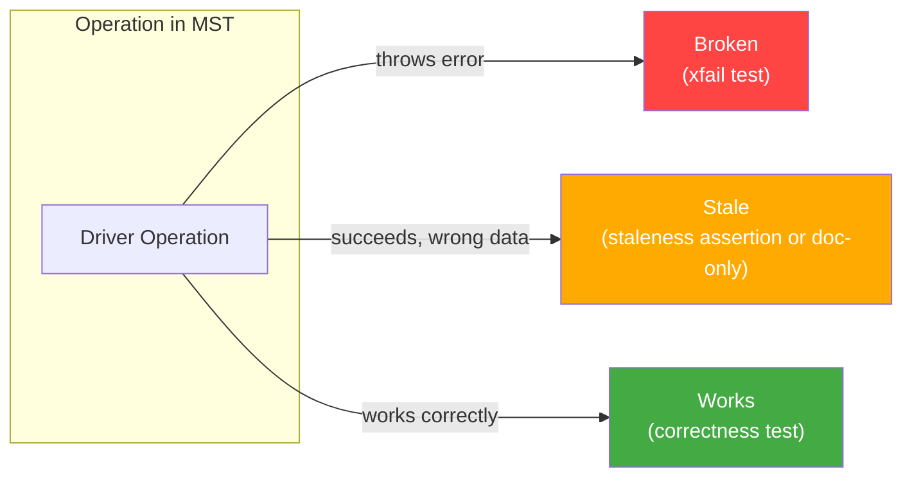
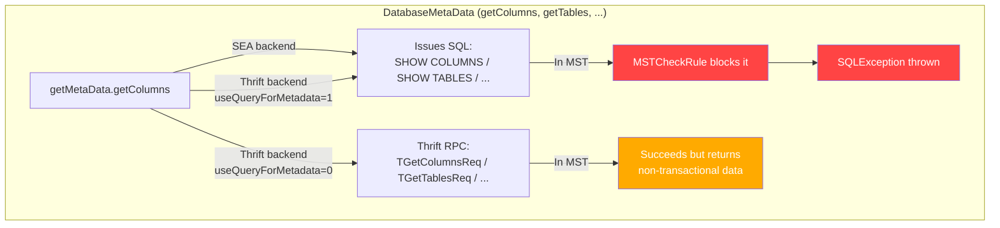
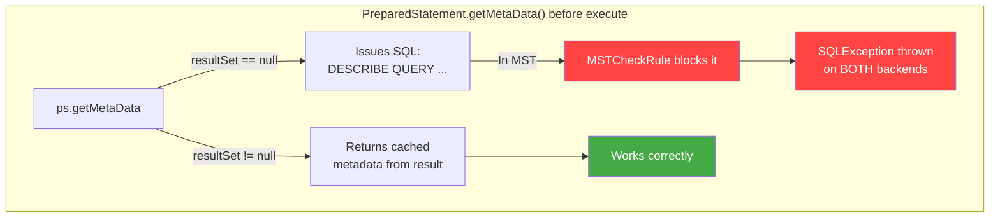
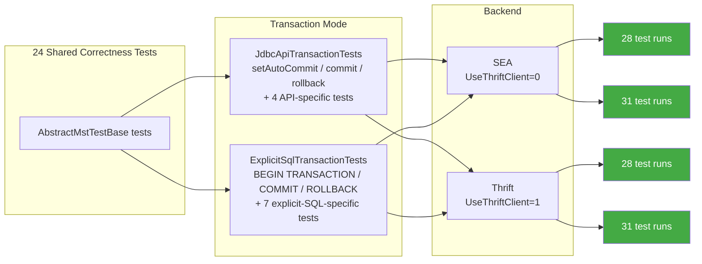
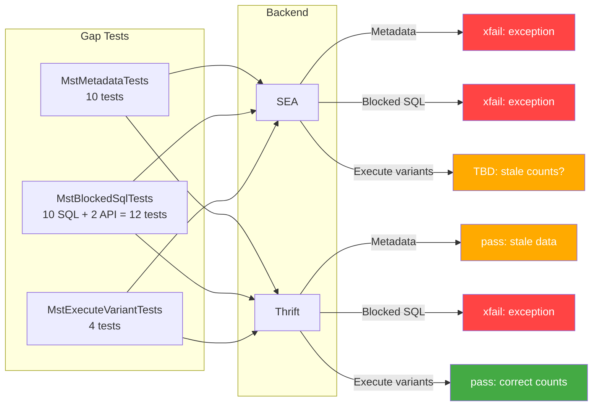
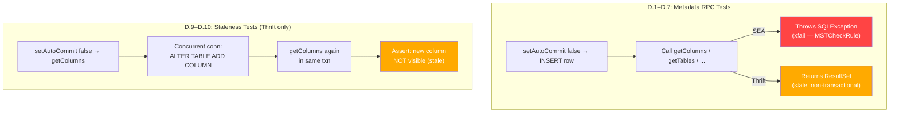
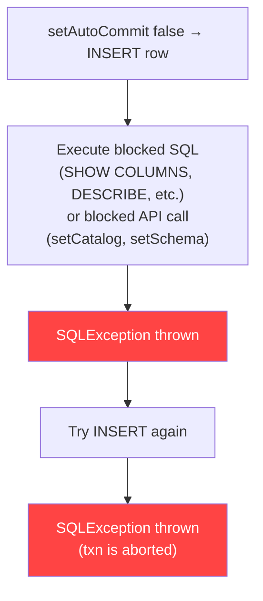
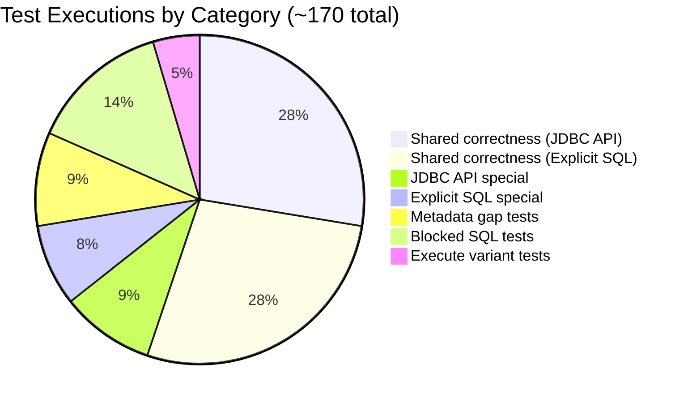
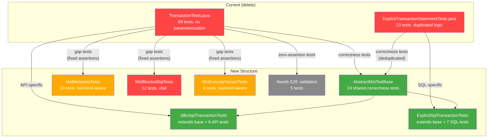

# MST Transaction Test Design

## Context

Multi-Statement Transactions (MST) interact with many JDBC driver code paths differently depending on the backend (SEA vs Thrift). Several server-side bugs (LC-13424, LC-13425, LC-13427, LC-13428) cause operations to either **break** (throw errors) or return **stale data** inside transactions. This test suite provides comprehensive coverage so the server team can validate fixes as they land.

Reference: [MST + xDBC Metadata RPCs audit](https://docs.google.com/document/d/1WSX5imeH8lwiWB6hrKJbL-D6iROxZ7EPWhdxzu-ObTo/edit)

## Operation Categorization

Every driver operation that touches MST falls into one of three buckets:



### How operations route through the driver

The same JDBC method can take completely different code paths depending on the backend:





### Broken (throws error — test as xfail)

| Operation | SEA | Thrift | Bug |
|---|---|---|---|
| `getColumns()` | Broken — issues `SHOW COLUMNS`, blocked by MSTCheckRule | Works (but stale, see below) | LC-13425 |
| `getTables()` | Broken — issues `SHOW TABLES`, blocked | Works (stale) | LC-13425 |
| `getSchemas()` | Broken — issues `SHOW SCHEMAS`, blocked | Works (stale) | LC-13425 |
| `getCatalogs()` | Broken — issues `SHOW CATALOGS`, blocked | Works (stale) | LC-13425 |
| `getPrimaryKeys()` | Broken | Works (stale) | LC-13425 |
| `getCrossReference()` | Broken | Works (stale) | LC-13425 |
| `getFunctions()` | Broken — issues `SHOW FUNCTIONS`, blocked | Works (stale) | LC-13425 |
| `PreparedStatement.getMetaData()` before execute | Broken — issues `DESCRIBE QUERY` SQL | Broken — same path, issues SQL | LC-13425 |
| `setCatalog()` | Broken — `SET CATALOG` blocked in MST | Broken — same | |
| `setSchema()` | Broken — `USE SCHEMA` blocked in MST | Broken — same | |
| All SHOW/DESCRIBE/information_schema SQL | Broken — MSTCheckRule | Broken — MSTCheckRule | LC-13425 |

### Stale (succeeds but returns non-transactional data)

| Operation | Backend | Behavior | Testable? |
|---|---|---|---|
| `getColumns()`, `getTables()`, `getSchemas()`, `getCatalogs()`, `getPrimaryKeys()`, `getCrossReference()`, `getFunctions()` via Thrift RPC | Thrift (default) | Thrift RPCs bypass MST context entirely. Succeed but return data that doesn't reflect uncommitted transaction state. | Yes — assert staleness via concurrent DDL |
| `executeUpdate()` / `executeBatch()` row counts | SEA | Returns incorrect/stale row counts. The DML itself works but the returned count is wrong. | TBD — need E2E to confirm exact return value |

### Works (test for correctness)

Basic DML (`execute`, `executeQuery`), commit/rollback, isolation, error handling, connection lifecycle, `PreparedStatement.getMetaData()` after execute, `getParameterMetaData()`.

## Test Architecture

### Class Hierarchy

```mermaid
classDiagram
    class AbstractMstTestBase {
        <<abstract>>
        #Connection connection
        #int useThrift
        +setUp() void
        +tearDown() void
        #startTransaction(Connection)* void
        #commitTransaction(Connection)* void
        #rollbackTransaction(Connection)* void
        #isSEA() boolean
        #isThrift() boolean
        #getJdbcUrl(int useThrift) String
        +testCommitSingleInsert()
        +testRollbackSingleInsert()
        +testMultiTableCommit()
        +... 21 more shared tests
    }
    note for AbstractMstTestBase "Parameterized: SEA + Thrift.\n\n24 shared correctness tests\nrun on BOTH backends.\nMode-agnostic: uses abstract\nstartTransaction/commit/rollback."

    class JdbcApiTransactionTests {
        #startTransaction() → setAutoCommit false
        #commitTransaction() → connection.commit
        #rollbackTransaction() → connection.rollback
        +testDefaultAutoCommitIsTrue()
        +testSetAutoCommitDuringActiveTxnThrows()
        +testUnsupportedIsolationLevel()
        +testSupportedIsolationLevel()
    }
    note for JdbcApiTransactionTests "4 JDBC-API-specific tests\n+ inherits 24 shared tests"

    class ExplicitSqlTransactionTests {
        #startTransaction() → BEGIN TRANSACTION
        #commitTransaction() → COMMIT
        #rollbackTransaction() → ROLLBACK
        +testNestedBeginTransactionFails()
        +testBeginFailsWhenAutocommitFalse()
        +testSetAutocommitFalseCommit()
        +testSetAutocommitFalseRollback()
        +testSetAutocommitTrue()
        +testSetAutocommitWithoutValue()
        +testSetAutocommitTrueDuringActiveTxnFails()
    }
    note for ExplicitSqlTransactionTests "7 explicit-SQL-specific tests\n+ inherits 24 shared tests.\nSET AUTOCOMMIT tests cover the\nimplicit SQL transaction mode."

    class MstMetadataTests {
        +testGetColumnsInMst()
        +testGetTablesInMst()
        +testGetSchemasInMst()
        +testGetCatalogsInMst()
        +testGetPrimaryKeysInMst()
        +testGetCrossReferenceInMst()
        +testGetFunctionsInMst()
        +testGetMetaDataBeforeExecute()
        +testGetColumnsStaleAfterConcurrentDDL()
        +testGetTablesStaleAfterConcurrentDDL()
    }
    note for MstMetadataTests "SEA: xfail (throws)\nThrift: pass (stale)\nStaleness tests: Thrift only\nUses JDBC API txn mode."

    class MstBlockedSqlTests {
        +testShowColumnsBlockedInMst()
        +testShowTablesBlockedInMst()
        +... 8 more blocked SQL tests
    }
    note for MstBlockedSqlTests "All xfail on both backends.\nVerify exception AND\ntxn abort.\nUses JDBC API txn mode."

    class MstExecuteVariantTests {
        +testExecuteUpdateRowCount()
        +testExecuteLargeUpdateRowCount()
        +testExecuteBatchRowCounts()
        +testPSExecuteBatchRowCounts()
    }
    note for MstExecuteVariantTests "SEA: TBD (stale counts)\nThrift: pass (correct counts)\nUses JDBC API txn mode."

    AbstractMstTestBase <|-- JdbcApiTransactionTests
    AbstractMstTestBase <|-- ExplicitSqlTransactionTests
    AbstractMstTestBase <|-- MstMetadataTests
    AbstractMstTestBase <|-- MstBlockedSqlTests
    AbstractMstTestBase <|-- MstExecuteVariantTests
```



### Design Principles

1. **Shared tests are mode-agnostic.** Tests in `AbstractMstTestBase` use `startTransaction()`, `commitTransaction()`, `rollbackTransaction()` — they never call `setAutoCommit()`, `connection.commit()`, `BEGIN TRANSACTION`, etc. directly. The subclass decides the mechanism.

2. **API-specific tests live in the subclass that owns the API.**
   - `testDefaultAutoCommitIsTrue`, `testSetAutoCommitDuringActiveTxnThrows`, `testUnsupportedIsolationLevel`, `testSupportedIsolationLevel` → `JdbcApiTransactionTests` (these use `setAutoCommit()`, `setTransactionIsolation()`, `getTransactionIsolation()`)
   - `testNestedBeginTransactionFails`, `testBeginFailsWhenAutocommitFalse`, SET AUTOCOMMIT tests → `ExplicitSqlTransactionTests`

3. **ExplicitSqlTransactionTests uses BEGIN TRANSACTION, not SET AUTOCOMMIT**, for the shared tests. SET AUTOCOMMIT tests are special cases that cover the implicit SQL transaction mode — they test the SET AUTOCOMMIT command itself, not transaction correctness.

4. **Gap tests use JDBC API mode** for transaction control (`setAutoCommit(false)`). MSTCheckRule doesn't care how the transaction was started, so we only need one transaction mode for these.

5. **setCatalog/setSchema are JDBC API calls** — they live in `MstBlockedSqlTests` (not the shared base) since they're testing gap behavior, not basic correctness.

### How tests execute across backends and transaction modes



The gap tests (MstMetadataTests, MstBlockedSqlTests, MstExecuteVariantTests) only use the JDBC API transaction mode — MSTCheckRule doesn't care how the transaction was started:



### Backend parameterization

Every test class is parameterized with `(useThrift, backendName)`:

```java
static Stream<Arguments> backends() {
    return Stream.of(
        Arguments.of(0, "SEA"),
        Arguments.of(1, "Thrift")
    );
}
```

Individual tests use `Assumptions` to skip when only relevant to one backend:

```java
// Example: staleness test only runs on Thrift
Assumptions.assumeTrue(isThrift(), "Staleness only testable on Thrift");

// Example: different assertion per backend
if (isSEA()) {
    assertThrows(SQLException.class, () -> dbmd.getColumns(...));
} else {
    ResultSet rs = dbmd.getColumns(...);
    assertTrue(rs.next()); // returns stale data, but doesn't throw
}
```

## Test Plan

### A. Shared correctness tests (in AbstractMstTestBase)

Run by both JdbcApiTransactionTests and ExplicitSqlTransactionTests, on both SEA and Thrift. All descriptions are mode-agnostic — `startTransaction()` / `commitTransaction()` / `rollbackTransaction()` are provided by the subclass.

| # | Test | Description | Expected |
|---|---|---|---|
| A.1 | `testCommitSingleInsert` | Start txn → INSERT → commit → verify row visible from separate conn | Pass |
| A.2 | `testCommitMultipleInserts` | Start txn → 3 INSERTs → commit → verify all 3 rows | Pass |
| A.3 | `testRollbackSingleInsert` | Start txn → INSERT → rollback → verify not persisted | Pass |
| A.4 | `testMultipleSequentialTransactions` | 3 sequential txns (commit, commit, rollback) → verify only first two persist | Pass |
| A.5 | `testAutoStartAfterCommit` | Commit txn1 → insert+rollback txn2 → only txn1 data persists | Pass |
| A.6 | `testAutoStartAfterRollback` | Rollback txn1 → insert+commit txn2 → only txn2 data persists | Pass |
| A.7 | `testUpdateInTransaction` | Insert with autocommit → start txn → UPDATE → commit → verify updated | Pass |
| A.8 | `testDeleteInTransaction` | Insert 2 rows → start txn → DELETE one → commit → verify 1 remains | Pass |
| A.9 | `testMultiTableCommit` | Start txn → insert into 2 tables → commit → verify both from separate conn | Pass |
| A.10 | `testMultiTableRollback` | Start txn → insert into 2 tables → rollback → verify neither persisted | Pass |
| A.11 | `testMultiTableAtomicity` | Start txn → insert into A → invalid SQL on B → rollback → verify A also rolled back | Pass |
| A.12 | `testCrossTableMerge` | Start txn → MERGE across source/target tables → commit → verify | Pass |
| A.13 | `testRepeatableReads` | Start txn → read → external conn modifies → re-read in txn → same value | Pass |
| A.14 | `testWriteConflictSingleTable` | Two concurrent txns on same table → first commits → second gets ConcurrentAppendException | Pass |
| A.15 | `testWriteSkewProvesSnapshotIsolation` | Two concurrent txns on different tables → both commit → proves Snapshot Isolation | Pass |
| A.16 | `testCommitWithoutActiveTxnThrows` | No active txn → commit → expect exception | Pass |
| A.17 | `testRollbackWithoutActiveTxnBehavior` | No active txn → rollback → JDBC API throws, explicit SQL ROLLBACK is no-op | Pass |
| A.18 | `testCloseConnectionImplicitRollback` | Start txn → insert → close() without commit → verify not persisted from new conn | Pass |
| A.19 | `testCloseConnectionDoesNotThrow` | Start txn → insert → close() → no exception | Pass |
| A.20 | `testEmptyTransactionRollback` | Start txn → rollback immediately → no exception | Pass |
| A.21 | `testReadOnlyTransaction` | Start txn → SELECT-only → commit → data unchanged | Pass |
| A.22 | `testRollbackAfterQueryFailure` | Start txn → insert → invalid SQL → rollback → new txn → insert → commit → verify recovery | Pass |
| A.23 | `testMultipleStatementsInSingleTxn` | Start txn → 3 Statement objects each insert → commit → verify 3 rows | Pass |
| A.24 | `testPreparedStatementInsert` | Start txn → parameterized INSERT → commit → verify | Pass |

### B. JdbcApiTransactionTests — API-specific tests

These use JDBC API methods (`setAutoCommit`, `setTransactionIsolation`, etc.) that only apply to the JDBC API transaction mode. Run on both backends.

| # | Test | Description | Expected |
|---|---|---|---|
| B.1 | `testDefaultAutoCommitIsTrue` | New connection → assert `getAutoCommit()` returns true | Pass |
| B.2 | `testSetAutoCommitDuringActiveTxnThrows` | `setAutoCommit(false)` → INSERT → `setAutoCommit(true)` → expect exception | Pass |
| B.3 | `testUnsupportedIsolationLevel` | `setTransactionIsolation(READ_UNCOMMITTED/READ_COMMITTED/SERIALIZABLE)` → expect exception for each | Pass |
| B.4 | `testSupportedIsolationLevel` | `setTransactionIsolation(REPEATABLE_READ)` → `getTransactionIsolation()` → verify | Pass |
| B.5 | `testPreparedStatementUpdate` | `setAutoCommit(false)` → insert → parameterized UPDATE → commit → verify | Pass |
| B.6 | `testPreparedStatementReuseAcrossTransactions` | Same PreparedStatement used in txn1 (commit) and txn2 (commit) → verify both rows | Pass |
| B.7 | `testPreparedStatementGetMetaDataAfterExecute` | `setAutoCommit(false)` → execute PreparedStatement SELECT → `getMetaData()` → verify column count | Pass |
| B.8 | `testGetParameterMetaData` | `setAutoCommit(false)` → create parameterized PreparedStatement → `getParameterMetaData()` → verify non-null | Pass |

### C. ExplicitSqlTransactionTests — SQL-specific tests

These test SQL-level transaction control. The shared tests inherited from `AbstractMstTestBase` use `BEGIN TRANSACTION` / `COMMIT` / `ROLLBACK`. The special tests below cover behavior unique to SQL transaction statements. Run on both backends.

| # | Test | Description | Expected |
|---|---|---|---|
| C.1 | `testNestedBeginTransactionFails` | `BEGIN TRANSACTION` → `BEGIN TRANSACTION` → expect exception | Pass |
| C.2 | `testBeginFailsWhenAutocommitFalse` | `SET AUTOCOMMIT = FALSE` → `BEGIN TRANSACTION` → expect exception (can't use explicit BEGIN in implicit mode) | Pass |
| C.3 | `testSetAutocommitFalseCommit` | `SET AUTOCOMMIT = FALSE` → INSERT → `COMMIT` → verify persisted (tests implicit SQL transaction mode) | Pass |
| C.4 | `testSetAutocommitFalseRollback` | `SET AUTOCOMMIT = FALSE` → INSERT → `ROLLBACK` → verify not persisted | Pass |
| C.5 | `testSetAutocommitTrue` | `SET AUTOCOMMIT = FALSE` → commit → `SET AUTOCOMMIT = TRUE` → INSERT auto-commits → verify | Pass |
| C.6 | `testSetAutocommitWithoutValue` | `SET AUTOCOMMIT` → returns current value → change → query again → different value | Pass |
| C.7 | `testSetAutocommitTrueDuringActiveTxnFails` | `SET AUTOCOMMIT = FALSE` → INSERT → `SET AUTOCOMMIT = TRUE` → expect exception | Pass |

### D. MstMetadataTests — metadata RPCs in MST

Uses JDBC API mode (`setAutoCommit(false)`) for transaction control. Run on both backends with backend-aware assertions.



| # | Test | SEA | Thrift |
|---|---|---|---|
| D.1 | `testGetColumnsInMst` | xfail: expect exception | Pass: returns results (stale) |
| D.2 | `testGetTablesInMst` | xfail: expect exception | Pass: returns results (stale) |
| D.3 | `testGetSchemasInMst` | xfail: expect exception | Pass: returns results (stale) |
| D.4 | `testGetCatalogsInMst` | xfail: expect exception | Pass: returns results (stale) |
| D.5 | `testGetPrimaryKeysInMst` | xfail: expect exception | Pass: returns results (stale) |
| D.6 | `testGetCrossReferenceInMst` | xfail: expect exception | Pass: returns ResultSet |
| D.7 | `testGetFunctionsInMst` | xfail: expect exception | Pass: returns results (stale) |
| D.8 | `testPreparedStatementGetMetaDataBeforeExecute` | xfail: expect exception (DESCRIBE QUERY blocked) | xfail: same |
| D.9 | `testGetColumnsStaleAfterConcurrentAddColumn` | Skip (would throw before staleness check) | Assert: second `getColumns()` does NOT see new column added by concurrent conn |
| D.10 | `testGetTablesStaleAfterConcurrentCreateTable` | Skip | Assert: second `getTables()` does NOT see new table created by concurrent conn |

### E. MstBlockedSqlTests — SQL introspection blocked by MSTCheckRule

Uses JDBC API mode. Run on both backends. All xfail — each test starts a txn via `setAutoCommit(false)`, INSERTs a row, executes the blocked SQL, expects exception, then verifies txn is aborted (subsequent INSERT also throws).



| # | Test | Operation |
|---|---|---|
| E.1 | `testShowColumnsBlockedInMst` | `SHOW COLUMNS IN <table>` |
| E.2 | `testShowTablesBlockedInMst` | `SHOW TABLES IN <schema>` |
| E.3 | `testShowSchemasBlockedInMst` | `SHOW SCHEMAS IN <catalog>` |
| E.4 | `testShowCatalogsBlockedInMst` | `SHOW CATALOGS` |
| E.5 | `testShowFunctionsBlockedInMst` | `SHOW FUNCTIONS` |
| E.6 | `testDescribeQueryBlockedInMst` | `DESCRIBE QUERY SELECT * FROM <table>` |
| E.7 | `testDescribeTableExtendedBlockedInMst` | `DESCRIBE TABLE EXTENDED <table>` |
| E.8 | `testDescribeTableBlockedInMst` | `DESCRIBE TABLE <table>` |
| E.9 | `testDescribeColumnBlockedInMst` | `DESCRIBE <table>.<column>` |
| E.10 | `testInformationSchemaBlockedInMst` | `SELECT FROM information_schema.columns` |
| E.11 | `testSetCatalogBlockedInMst` | `connection.setCatalog()` — JDBC API call |
| E.12 | `testSetSchemaBlockedInMst` | `connection.setSchema()` — JDBC API call |

### F. MstExecuteVariantTests — execute method row counts

Uses JDBC API mode. Backend-aware assertions.

| # | Test | SEA | Thrift |
|---|---|---|---|
| F.1 | `testExecuteUpdateRowCount` | TBD after E2E — assert stale count if confirmed | Pass: assert correct count |
| F.2 | `testExecuteLargeUpdateRowCount` | TBD after E2E | Pass: assert correct count |
| F.3 | `testExecuteBatchRowCounts` | TBD after E2E | Pass: assert correct counts |
| F.4 | `testPreparedStatementExecuteBatchRowCounts` | TBD after E2E | Pass: assert correct counts |

### G. Tests needing E2E validation before assertions

These tests exist in the current code with zero or speculative assertions. We keep them but need to run E2E to determine the correct assertion.

| # | Test | What to determine via E2E |
|---|---|---|
| G.1 | `testDDLCreateTableInMst` | Does CREATE TABLE inside MST throw? If rollback, does the table still exist? |
| G.2 | `testDDLDropTableInMst` | Does DROP TABLE inside MST throw? If rollback, is the table restored? |
| G.3 | `testDDLAlterTableInMst` | Does ALTER TABLE inside MST throw? If rollback, is the schema unchanged? |
| G.4 | `testEmptyTransactionCommit` | Does committing an empty transaction succeed or throw? |
| G.5 | `testRetryAfterConcurrentAppendException` | What is the deterministic row count after retry? |

## Test Counts



| Class | Unique tests | Executions (×2 backends) |
|---|---|---|
| AbstractMstTestBase (via JdbcApiTransactionTests) | 24 shared + 8 API-specific = 32 | 64 |
| AbstractMstTestBase (via ExplicitSqlTransactionTests) | 24 shared + 7 SQL-specific = 31 | 62 |
| MstMetadataTests | 10 | 16 (some skip on one backend) |
| MstBlockedSqlTests | 12 | 24 |
| MstExecuteVariantTests | 4 | 8 |
| Needs E2E validation | 5 | 10 |
| **Total** | **62 unique** | **~184 executions** |

## Migration from current tests

### Current state

- `TransactionTests.java` — 69 tests, not parameterized, hardcoded credentials, mixes correctness tests with gap tests, many weak/incorrect assertions
- `ExplicitTransactionStatementTests.java` — 23 tests, duplicates many correctness tests from TransactionTests

### What changes



1. **Delete** both existing files
2. **Create** the new class hierarchy
3. **Move** correctness tests into `AbstractMstTestBase` (deduplicated)
4. **Move** API-specific tests into `JdbcApiTransactionTests` (setAutoCommit, isolation level, PreparedStatement metadata)
5. **Move** SQL-specific tests into `ExplicitSqlTransactionTests` (BEGIN TRANSACTION, SET AUTOCOMMIT)
6. **Fix** gap tests: replace speculative assertions with backend-aware xfail/staleness assertions
7. **Keep** DDL/empty-commit/retry tests in a pending state — run E2E to determine assertions
8. **Add** staleness tests (D.9, D.10) — new, didn't exist before
9. **Parameterize** everything on SEA/Thrift

### Tests removed from current code (and why)

| Test | Reason |
|---|---|
| `testExceptionDetailsPreserved` | Tests driver exception internals, not MST behavior |
| `testResultSetHoldabilityOverCommit` | Not MST-specific |
| `testTransactionContinuesAfterAllowedMetadataOp` | Redundant with multi-insert correctness tests |
| `testParameterizedDMLAfterConcurrentAlterTable` | Same underlying issue as metadata staleness (covered by D.9) |
| `testTransactionAfterStatementTimeout` | No meaningful assertion possible without E2E — revisit later |

## Open items

- [ ] Run E2E on SEA to confirm `executeUpdate()` row count behavior (stale value vs exception)
- [ ] Run E2E to confirm `getMetaData()` before execute throws on both backends
- [ ] Run E2E for DDL tests (G.1–G.3) and empty commit (G.4) to determine correct assertions
- [ ] Decide if `isValid()` inside MST needs a test (currently issues `SELECT VERSION()`, likely works)
- [ ] Python driver test refactoring (separate effort, similar structure but no Thrift/SEA split needed today since Python defaults to Thrift)
